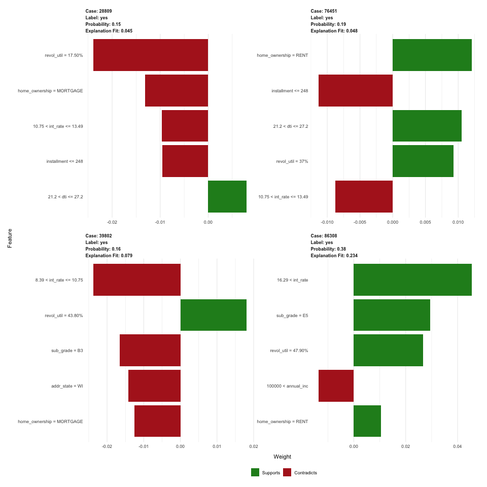

# Predicting Adverse Outcomes for Debt Consolidation Loans {.tabset .tabset-fade}

## Introduction 

Lending Club is a peer-to-peer lending platform based in the U.S. On their website, they regularly publish datasets that include attributes about the customer and loan that are collected at the time of application or during the debt repayment window. 

These datasets are quite popular among Kaggle competitors and other data science enthusiasts. For additional information about Lending Club, visit any of the links below.

- Wiki: https://en.wikipedia.org/wiki/Lending_Club
- Website: https://www.lendingclub.com
- Datasets: https://www.lendingclub.com/info/download-data.action

In this report, we share the results of a modeling exercise in which we attempt to predict adverse outcomes for Lending Club loans to be used for debt consolidation purposes. The dataset used for this exercise are related to loan applications processed in **2016, Quarter 2**.

## Dataset {.tabset .tabset-fade}

The 2016 Q2 dataset consisted of 97858 records. Selected Lending Club attributes were joined to state-level population summaries to produce the modeling dataset.  For the analysis, we focused on the 54783 loans for debt consolidation. Late payment, default, or charge-off loan statuses were flagged as adverse (undesirable) outcomes.

A sample of 100 rows is provided in the following table. 
 
 

<!--html_preserve-->

<!--/html_preserve-->

## Descriptive summaries {.tabset .tabset-fade}

The data consisted of a mix of numerical and categorical attributes and only a few missing values. 

- The most popular type of loan was debt consolidation, comprising 54783 / 97858 (55.98%) of all loans. 
- Most of the loans received a grade of B or C. 
- Loan amounts for debt consolidation ranged from 1000 to 40000 dollars (U.S.). 
- Interest rate increases as grades decrease from A to G.

For details, click on any of the following tabs.
 
 
 
### Attribute details

Table: Data types and missing data summaries

     Data Types             Missing Data (N)   Missing Data (%)   Description   NA                                                                                                                                                                                                       
---  ---------------------  -----------------  -----------------  ------------  ---------------------------------------------------------------------------------------------------------------------------------------------------------------------------------------------------------
1    addr_state             factor             0                  0             The state provided by the borrower in the loan application                                                                                                                                               
2    annual_inc             numeric            0                  0             The self-reported annual income provided by the borrower during registration.                                                                                                                            
3    delinq_2yrs            integer            0                  0             The number of 30+ days past-due incidences of delinquency in the borrower's credit file for the past 2 years                                                                                             
4    dti                    numeric            0                  0             A ratio calculated using the borrower’s total monthly debt payments on the total debt obligations, excluding mortgage and the requested LC loan, divided by the borrower’s self-reported monthly income. 
5    emp_length             factor             0                  0             Employment length in years. Possible values are between 0 and 10 where 0 means less than one year and 10 means ten or more years.                                                                        
6    grade                  factor             0                  0             LC assigned loan grade                                                                                                                                                                                   
7    Growth2018             numeric            4                  0             State population growth in 2018                                                                                                                                                                          
8    home_ownership         factor             0                  0             The home ownership status provided by the borrower during registration or obtained from the credit report. Our values are: RENT, OWN, MORTGAGE, OTHER                                                    
9    inq_last_6mths         integer            0                  0             The number of inquiries in past 6 months (excluding auto and mortgage inquiries)                                                                                                                         
10   installment            numeric            0                  0             The monthly payment owed by the borrower if the loan originates.                                                                                                                                         
11   int_rate               numeric            4                  0             Interest Rate on the loan                                                                                                                                                                                
12   loan_amnt              integer            0                  0             The listed amount of the loan applied for by the borrower. If at some point in time, the credit department reduces the loan amount, then it will be reflected in this value.                             
13   loan_status            factor             0                  0             Current status of the loan                                                                                                                                                                               
14   open_acc               integer            0                  0             The number of open credit lines in the borrower's credit file.                                                                                                                                           
15   Percent_of_US          numeric            4                  0             State population's percent of U.S. population in 2018                                                                                                                                                    
16   Population2018         integer            4                  0             State population (count) in 2018                                                                                                                                                                         
17   pub_rec                integer            0                  0             Number of derogatory public records                                                                                                                                                                      
18   pub_rec_bankruptcies   integer            0                  0             Number of public record bankruptcies                                                                                                                                                                     
19   purpose                factor             0                  0             A category provided by the borrower for the loan request.                                                                                                                                                
20   revol_bal              integer            0                  0             Total credit revolving balance                                                                                                                                                                           
21   revol_util             factor             0                  0             Revolving line utilization rate, or the amount of credit the borrower is using relative to all available revolving credit.                                                                               
22   sub_grade              factor             0                  0             LC assigned loan subgrade                                                                                                                                                                                
23   term_months            numeric            4                  0             Loan term (36 or 60 months)                                                                                                                                                                              
24   total_acc              integer            0                  0             The total number of credit lines currently in the borrower's credit file                                                                                                                                 
25   verification_status    factor             0                  0             Indicates if income was verified by LC, not verified, or if the income source was verified                                                                                                               

### Loan Purpose

### Loan Grade

### Loan Amount

### Interest Rate

## Modeling {.tabset .tabset-fade}

Training, testing, and validation percentages were 60%, 20%, and 20%, respectively. Model details are provided in the tabs below.
 
 

### AutoML

We allowed the AutoML model search algorithm to run for 150 seconds, fitting a total of 10 models. Model StackedEnsemble_AllModels_0_AutoML_20181103_130131 had the highest cross-validated AUC (0.69).  
 
 

<!--html_preserve-->

<!--/html_preserve-->

### LIME

The Local Interpretable Model-Agnostic Explanations (LIME) algorithm was used to provide some insight into the variables that contributed to the model predictions of a few selected loan cases.
 
 

### Variable Importance
<!--html_preserve-->

<!--/html_preserve-->

Time stamp of last report run: 2018-11-03 13:04:42

