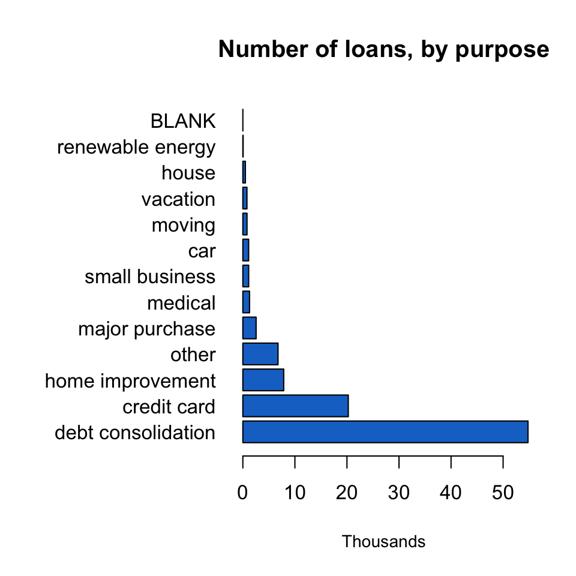
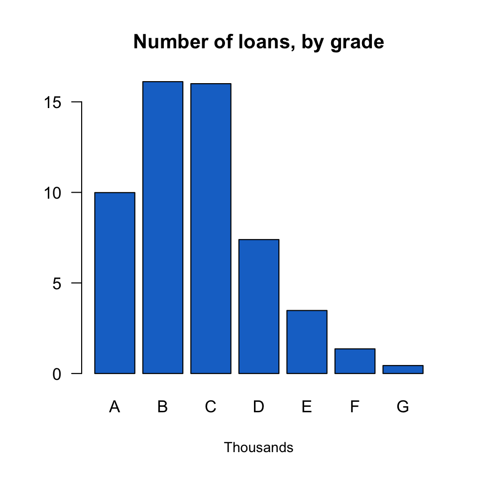
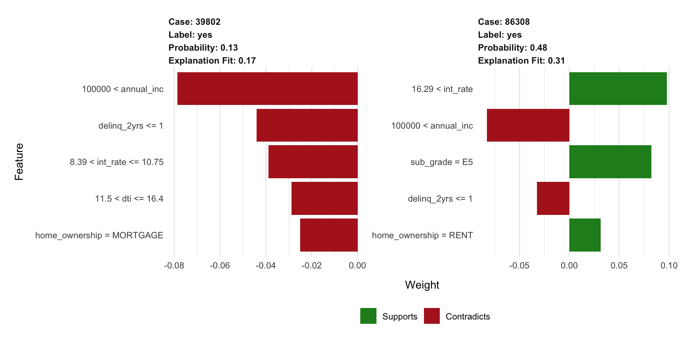

```{r setup, include=FALSE}
require("knitr")
wd = "/Users/sw659h/Documents/training/mysql/repos/workflow-automation/reports"
opts_knit$set(root.dir = wd)
opts_chunk$set(echo = TRUE)
knitr::opts_chunk$set(echo = FALSE)
knitr::opts_chunk$set(warning = FALSE)
knitr::opts_chunk$set(comment = NA)
options(bitmapType = 'cairo')
```


```{r read, results='hide'}
## Load libraries
rm(list=ls())
suppressMessages(library(knitr))
suppressMessages(library(h2o))
#suppressMessages(library(htmlTable))
suppressMessages(library(readxl))
suppressMessages(library(DT))
suppressMessages(library(lime))

kable2 = function(table, rn=T, caption='') {
  kable(table, row.names=rn, align='lll', format.args = list(big.mark = ","), caption=caption)
}
```


```{r}
## Load saved objects created in execution of get_data.R
load('../model_results/saved_objects.RData')
items = names(saved_objects)
for (item in items) assign(item, saved_objects[[item]])
obj_names = lapply(saved_objects, function(u) names(u))
for (obj_nm in names(obj_names)) {
  items = obj_names[[obj_nm]]
  for (item in items) assign(item, saved_objects[[obj_nm]][[item]])
}
rm(saved_objects,item,items, obj_names, obj_nm,partitions,automl_seed)


## Merge data dictionary with data summary
dsum = data.frame(field_name=rownames(overall$dsummary), overall$dsummary); #head(dsum)
dict = read_excel('../data/dictionary/LCDataDictionary.xlsx', 1)
dsum = merge(dsum, dict, by.x='field_name', by.y='LoanStatNew', all.x=T)
dsum[dsum$field_name=='Growth2018', 'Description'] = 'State population growth in 2018'
dsum[dsum$field_name=='Percent_of_US', 'Description'] = "State population's percent of U.S. population in 2018"
dsum[dsum$field_name=='Population2018', 'Description'] = 'State population (count) in 2018'
dsum[dsum$field_name=='term_months', 'Description'] = 'Loan term (36 or 60 months)'


## Add field descriptions to variable importance table
varimp_desc = merge(varimp, dict[,c('LoanStatNew', 'Description')], by.x='variable', by.y='LoanStatNew', all.x=T)
varimp_desc = varimp_desc[order(varimp_desc$percentage, decreasing=T),]
rownames(varimp_desc) = NULL
varimp_desc[varimp_desc$variable=='Growth2018', 'Description'] = 'State population growth in 2018'
varimp_desc[varimp_desc$variable=='Percent_of_US', 'Description'] = "State population's percent of U.S. population in 2018"
varimp_desc[varimp_desc$variable=='Population2018', 'Description'] = 'State population (count) in 2018'
varimp_desc[varimp_desc$variable=='term_months', 'Description'] = 'Loan term (36 or 60 months)'
varimp_desc[varimp_desc$variable=='State', 'Description'] = dict$Description[dict$LoanStatNew=='addr_state'][1]
varimp_desc[varimp_desc$variable=='Rank', 'Description'] = 'State ranking by 2018 population size'

colnames(dsum) = c('Field name', 'Data Types', 'Missing Data (N)', 'Missing Data (%)', 'Description')

```


```{r}
## Pretty printing of training/validation/testing splits
splits = paste(parameters$data_splits_pct, '%', sep='')
splits_msg = paste(splits[1], ', ', splits[2], ', and ', splits[3], sep='')

## Most popular type of loan (purpose)
popular_purpose = overall$cnt_by_purpose[which.max(overall$cnt_by_purpose)]
purpose_nm = gsub('_', ' ', tolower(names(popular_purpose)))
purpose_cnt = as.numeric(popular_purpose)
purpose_cnt_pct = round(purpose_cnt / overall$num_records * 100, 2)
purpose_msg = paste(purpose_cnt, ' / ', overall$num_records, ' (', purpose_cnt_pct, '%)', sep='')

## Loan amount ranges
loan_range = range(dat$loan_amnt)
loan_range = paste(loan_range[1], 'to', loan_range[2])

## AutoML Leaderboard
lead = leaderboard[1,]
lead[,-1] = round(lead[,-1],2)
#lead[,]
```


# Predicting Adverse Outcomes for Debt Consolidation Loans {.tabset .tabset-fade}


## Introduction 

Lending Club is a peer-to-peer lending platform based in the U.S. On their website, they regularly publish datasets that include attributes about the customer and loan that are collected at the time of application or during the debt repayment window. 

These datasets are quite popular among Kaggle competitors and other data science enthusiasts. For additional information about Lending Club, visit any of the links below.

- Wiki: https://en.wikipedia.org/wiki/Lending_Club
- Website: https://www.lendingclub.com
- Datasets: https://www.lendingclub.com/info/download-data.action

In this report, we share the results of a modeling exercise in which we attempt to predict adverse outcomes for Lending Club loans to be used for debt consolidation purposes. The dataset used for this exercise are related to loan applications processed in **`r year`, Quarter `r quarter`**.
<br>
<br>
<br>
<br>
<br>
<br>
<br>
Report updated `r Sys.time()`.

## Dataset {.tabset .tabset-fade}

The `r paste(year, ' Q', quarter, sep='')` dataset consisted of `r overall$num_records` records. Selected Lending Club attributes were joined to state-level population summaries to produce the modeling dataset.  For the analysis, we focused on the `r analysis_subset$num_records` loans for debt consolidation. Late payment, default, or charge-off loan statuses were flagged as adverse (undesirable) outcomes.

A sample of 100 rows is provided in the following table. 
<br>
<br>

```{r}
set.seed(147)
id_sample = sample(1:nrow(dat), 100)
dat_sample = dat[id_sample,]
rownames(dat_sample) = NULL
```


```{r, results='asis'}
datatable(dat_sample, caption='Lending Club loans for debt consolidation (data sample)') 
```


## Descriptive summaries {.tabset .tabset-fade}

The data consisted of a mix of numerical and categorical attributes and only a few missing values. 

- The most popular type of loan was `r purpose_nm`, comprising `r purpose_msg` of all loans. 
- Most of the loans received a grade of B or C. 
- Loan amounts for debt consolidation ranged from `r loan_range` dollars (U.S.). 
- Interest rate increases as grades decrease from A to G.

For details, click on any of the following tabs.
<br>
<br>
 
### Attribute details
```{r, results='asis'}
kable2(dsum, caption='Data types and missing data summaries') 
```


### Loan Purpose
{width=500px}

### Loan Grade
{width=500px}

### Loan Amount
{width=500px}

### Interest Rate
{width=500px}

## Modeling {.tabset .tabset-fade}

Training, testing, and validation percentages were `r splits_msg`, respectively. Model details are provided in the tabs below.
<br>
<br>

### AutoML

We allowed the AutoML model search algorithm to run for `r parameters$run_time` seconds, fitting a total of `r nrow(leaderboard)` models. Model `r lead[,"model_id"]` had the highest cross-validated AUC (`r lead[,"auc"]`).  
<br>
<br>

```{r, results='asis'}
datatable(leaderboard, caption='AutoML leaderboard') %>% formatRound(colnames(leaderboard), 3)
```

### LIME

The Local Interpretable Model-Agnostic Explanations (LIME) algorithm was used to provide some insight into the variables that contributed to the model predictions of a few selected loan cases.
<br>
<br>

{width=1400px}
<br>
{width=1400px}


### Variable Importance
```{r, results='asis'}
datatable(varimp_desc, caption='Variable Importance for top GBM') %>% formatRound(colnames(varimp_desc), 3)
```


```{r}

```


